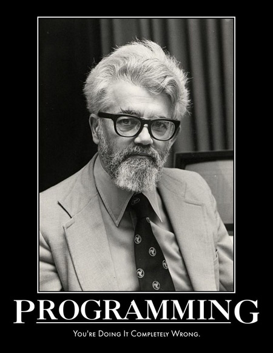

!SLIDE

#Construyendo un lenguaje: lisp en lisp

!SLIDE bullets

##Para probar:

* Podés usar el verdadero lenguaje acá <http://try-clojure.org/>
* O bajar este intérprete. <http://lfborjas.com/lisp.jar> 
  (y correrlo con `java -jar lisp.jar`)

!SLIDE 

#¿Para qué?

!SLIDE center

